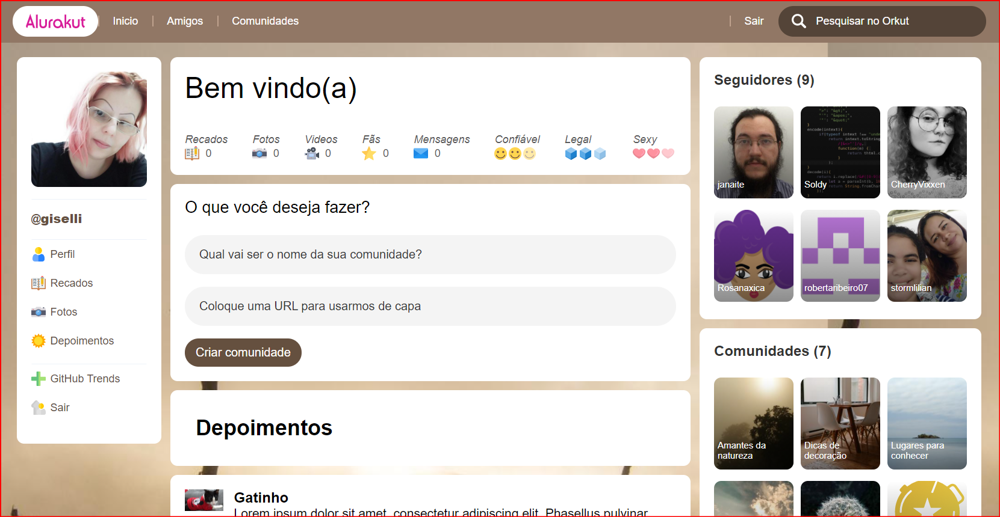

# Projeto Alurakut
## Imersão React Alura - 2021

Projeto desenvolvido na semana de imersão React oferecida pela escola [Alura](https://alura.com.br) entre os dias 12 e 18/07/21 utilizando o React para criar uma versão atualizada da extinta plataforma Orkut.
Tivemos como instrutores Mário Souto Coutinho ([@omariosouto](https://github.com/omariosouto)) e Juliana Negreiros ([@juunegreiros](https://github.com/juunegreiros)).

O deploy está na Vercel no seguinte link:

### [https://alurakut-three-jet.vercel.app](https://alurakut-three-jet.vercel.app)

